# LLM Dev Control Tower — User Flows (Sequence Diagrams)

Every distinct user flow a user can take in this system, end-to-end across **web → API →
lifecycle → DB / Claude / memory / wiki**, as sequence diagrams.

> **Method (ultracode):** four agents enumerated flows in parallel from independent vantages —
> frontend (42), spec+wireframe (33), data-coupling (24), backend (24) — ~123 raw flows. Those were
> deduplicated into the canonical catalog below and each rendered from the real code paths.

## Participants

| Alias | Maps to |
|-------|---------|
| **User** | The human operator (Kay) |
| **UI** | The React component (`ProjectMap`, `TicketBoard`, `Cockpit`, `PlanApproval`, `ReviewSummary`/`ReviewPane`, `BugTrace`, `Legend`, `ProjectsHome`) |
| **Store** | Zustand `useStore` (`load`, `selectTicket`, `setMode`, `openInCockpit`, …) + 1.5 s live polling |
| **Api** | `ApiClient` seam — `HttpApiClient` (real REST) or `MockApiClient` (in-browser sim) |
| **Server** | FastAPI routers (`graph.py`, `lifecycle.py`, `memory.py`) |
| **Graph** | The per-ticket LangGraph lifecycle (`lifecycle_graph.py`: propose→approve→execute_step→review) |
| **LLM** | Planner / Executor via `claude -p` (real mode) — `CliPlanner` / `CliExecutor` |
| **DB** | SQLAlchemy graph store (`graph/store.py`, `diff_ingest.py`) over SQLite/Postgres |
| **Mem** | `MemoryStore` (LangChain embeddings + vector store) |
| **Repo** | The target git repo the executor commits into |
| **Wiki** | `~/llm_wiki` (cross-project promotion) |

**Real vs mock:** With `VITE_API_BASE` set, `Api = HttpApiClient` → the real backend (diagrams below are
the canonical path). Without it, `Api = MockApiClient` → an in-browser simulation: no Server/DB/Claude;
plan-approve and review fake execution with a ~900 ms `gateLater` timer. Mock differences are noted per flow.

## Index

**A. App load & live data** — [A1 Initial load + live polling](#a1)
**B. Navigation & reading** — [B1 Map → ticket board → cockpit](#b1) · [B2 Navigator⇄Cockpit toggle & breadcrumbs](#b2) · [B3 Select step → step detail](#b3) · [B4 Projects home ⇄ project](#b4) · [B5 Bug trace → owning path](#b5) · [B6 Legend & CodeRegion layer](#b6)
**C. Planning** — [C1 New goal → propose → edit → approve → execute](#c1) · [C2 Re-plan a planning ticket](#c2) · [C3 Edit plan (add/delete/reorder/relabel)](#c3)
**D. Execution & review** — [D1 Step execution internals](#d1) · [D2 Review → approve (next step runs)](#d2) · [D3 Review → request changes (re-run)](#d3) · [D4 Review → takeover](#d4) · [D5 Full review pane](#d5) · [D6 Debug-trace a blocked step](#d6)
**E. Memory, promotion & lifecycle** — [E1 RAG context injected into the step prompt](#e1) · [E2 Project completion → wiki promotion](#e2) · [E3 Memory search (API)](#e3) · [E4 Memory reindex (API)](#e4) · [E5 Checkpoint/resume & simulated vs real](#e5)

---

## A. App load & live data

### A1 — Initial load + live polling
<a id="a1"></a>
**Trigger:** open the app. The store loads the graph once, then a 1.5 s poll keeps every screen live (no refresh button).

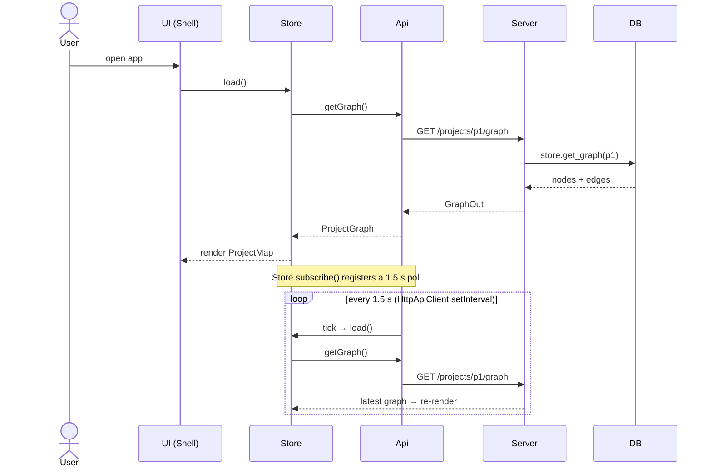
> Mock: `MockApiClient` serves an in-memory fixture; `subscribe` notifies on each mutation (no polling, no Server).

---

## B. Navigation & reading

### B1 — Project map → ticket board → cockpit
<a id="b1"></a>
**Trigger:** click a ticket on the map. Navigator drills into the ticket's **kanban board**; "리뷰 시작"/"디버그 추적" jumps into the Cockpit for that step.

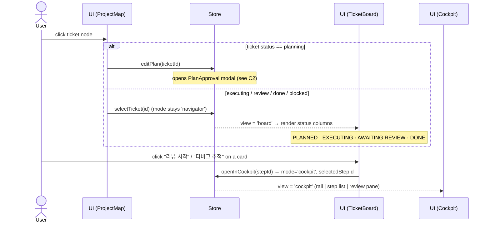
> `defaultStepFor` auto-focuses the awaiting-review step, else the blocked step, else the first.

### B2 — Navigator⇄Cockpit toggle & breadcrumbs
<a id="b2"></a>
**Trigger:** the top-bar segmented control and the project-name breadcrumb / "‹ 지도" button. Pure client state — no server.

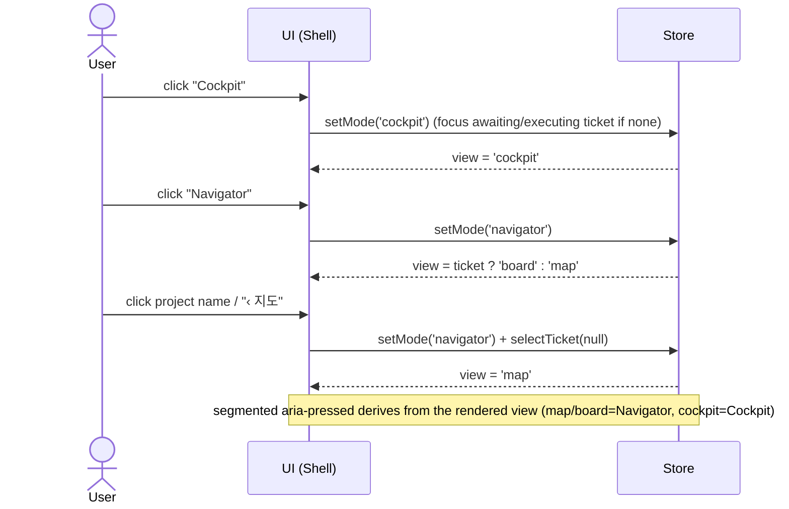

### B3 — Select a step → view step detail
<a id="b3"></a>
**Trigger:** click a step in the Cockpit lane (or open a review). The right pane fetches that step's diff, decision, acceptance.

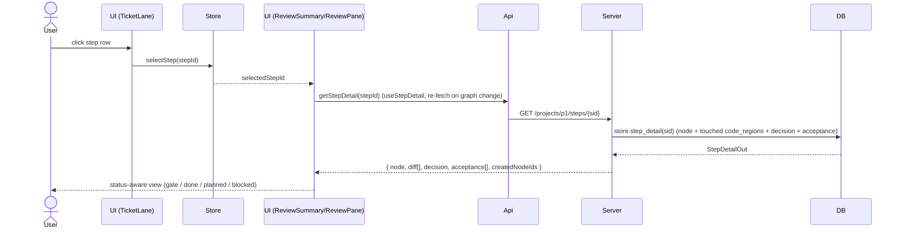

### B4 — Projects home ⇄ a project
<a id="b4"></a>
**Trigger:** click the "Control Tower" brand to see the projects list; click a project card to open it; the "새 목표" textarea + "분해 시작" on the home (or the map's "목표 · 티켓" button) starts a new goal.

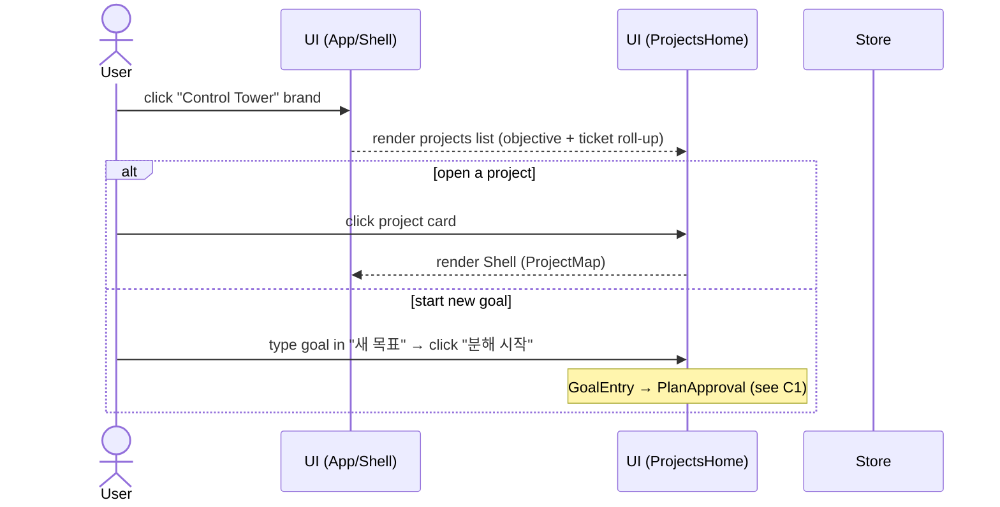

### B5 — Bug trace → highlight owning path
<a id="b5"></a>
**Trigger:** type a file/symbol in the top-bar trace box and pick a match. The map highlights CodeRegion → Step → Ticket → Objective and jumps to the map.

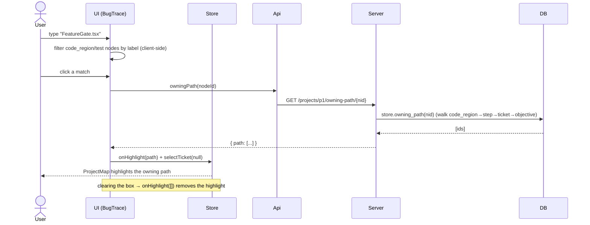

### B6 — Legend & CodeRegion layer
<a id="b6"></a>
**Trigger:** the top-bar "Legend" button (a popover of node-kind shapes + status colors) and the map's "CodeRegion 레이어" toggle. Pure client UI.

```mermaid
sequenceDiagram
    actor User
    participant UI as UI (Shell/ProjectMap)
    participant Store
    User->>UI: click "Legend"
    UI-->>User: toggle Legend popover (NODE KIND→shape, STATUS→color); scrim/✕ closes
    User->>UI: click "CodeRegion 레이어"
    UI->>Store: toggle code-region layer
    Store-->>UI: show/hide code_region nodes + touches edges on the map
```
> CodeRegion-layer toggle is **implemented**: it shows/hides all code_region nodes + their `touches`
> edges on the map (aria-pressed reflects state), and a bug trace (B5) onto a code_region/test node
> auto-reveals the layer.

---

## C. Planning

### C1 — New goal → propose → edit → approve → execute
<a id="c1"></a>
**Trigger:** the map's "목표 · 티켓" button → type a goal. The planner proposes steps (Claude in real mode); the user edits and approves; the lifecycle runs the first step and stops at its review gate.

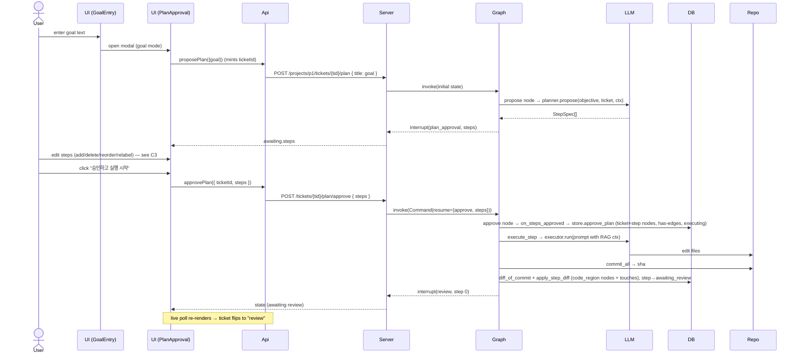
> Mock: `MockApiClient.approvePlan` creates the step nodes, sets the ticket executing, and **fakes** step 1 (`executing` → `awaiting_review` after a 900 ms `gateLater`, attaching a synthetic code_region) — no Server/Claude/Repo.

### C2 — Re-plan a planning ticket
<a id="c2"></a>
**Trigger:** click a **planning** ticket on the map (or in the Cockpit rail). Same approval flow as C1, but the planner re-proposes for the existing ticket.

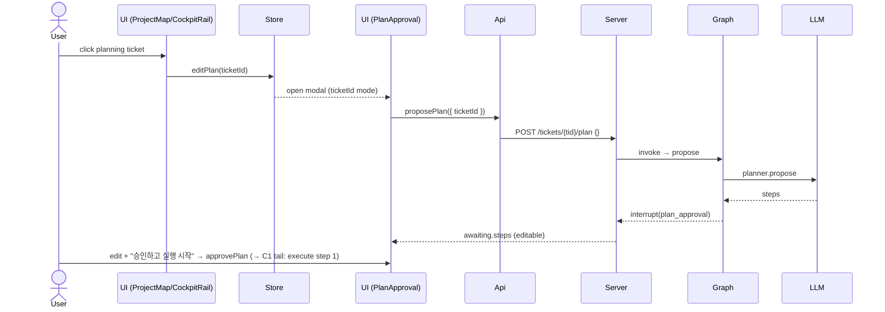
> `start_plan` is idempotent: if the graph is already past the plan gate, it returns current state instead of restarting (no checkpoint reset).

### C3 — Edit plan (add / delete / reorder / relabel steps)
<a id="c3"></a>
**Trigger:** inside the plan modal, before approving. Pure client-side edits to the proposed step list; persisted only on approve.

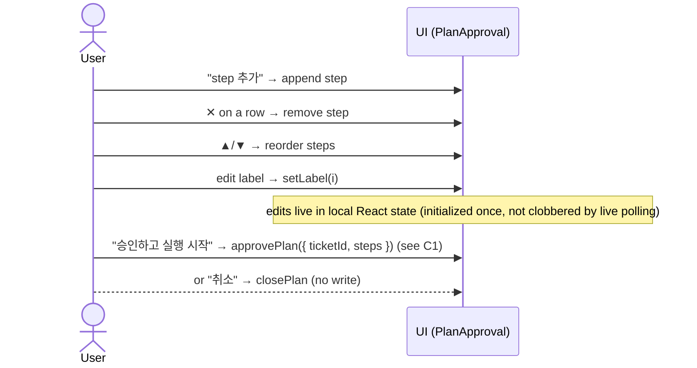

---

## D. Execution & review

### D1 — Step execution internals
<a id="d1"></a>
**Trigger:** the consequence of an approve (C1) or a review-advance (D2). The executor codes the step, commits it, and the diff is ingested into the graph.

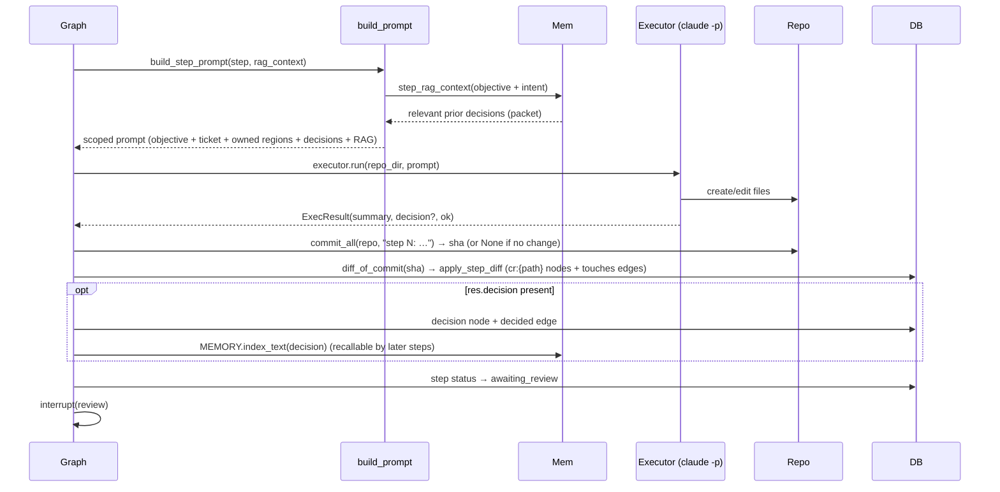
> Simulated mode swaps `LLM/Repo` for `SimulatedExecutor` (writes `generated/step_N.ts`); a git/diff failure degrades gracefully (step still gates, no diff ingested).

### D2 — Review → approve (next step runs)
<a id="d2"></a>
**Trigger:** "승인" in the Cockpit review pane. Resumes the graph: the step is done and the next step executes, stopping at its own gate.

```mermaid
sequenceDiagram
    actor User
    participant Pane as UI (ReviewSummary/ReviewPane)
    participant Api
    participant Server
    participant Graph
    participant DB
    User->>Pane: click "승인"
    Pane->>Api: reviewStep(stepId, { kind: 'approve' })
    Api->>Server: POST /projects/p1/steps/{sid}/review { kind: 'approve' }
    Server->>Graph: invoke(Command(resume={ kind: 'approve' }))
    Graph->>Graph: review node → current+1 → after_review → execute_step (next)
    Note over Graph,DB: next step executes + ingests (see D1)
    Graph-->>Server: interrupt(review, next) OR END (last step)
    Server->>DB: reviewed step → done; if END → ticket done
    Server->>Server: if _all_tickets_done → promote_project (see E2)
    Server-->>Pane: state → live poll re-renders board/cockpit
```
> Mock: `reviewStep('approve')` sets the step done and `gateLater`-runs the next planning step (`executing` → `awaiting_review`); last step → ticket done.

### D3 — Review → request changes (re-run)
<a id="d3"></a>
**Trigger:** "수정요청" (toggles a comment box) → "변경 요청 보내기" in the full review pane. The same step re-executes against the feedback. (Keyboard: `r`.)

```mermaid
sequenceDiagram
    actor User
    participant Pane as UI (ReviewPane)
    participant Api
    participant Server
    participant Graph
    participant LLM
    participant DB
    participant Mem
    User->>Pane: "수정요청" + comment → "변경 요청 보내기"
    Pane->>Api: reviewStep(stepId, { kind:'changes', comment })
    Api->>Server: POST /steps/{sid}/review { kind:'changes', comment }
    Server->>Graph: invoke(Command(resume={ kind:'changes' }))
    Graph->>Graph: review → review_kind=changes → after_review → execute_step (SAME index)
    Graph->>LLM: re-run step (new edits)
    Graph->>DB: re-commit + re-ingest; node label updated; step→awaiting_review
    Graph->>Mem: index the NEW decision (even though the node exists)
    Graph-->>Server: interrupt(review, same step)
    Server-->>Pane: state (re-gated for review)
```

### D4 — Review → takeover
<a id="d4"></a>
**Trigger:** "내가 인수" (full review pane; keyboard `t`) — the human takes the step over; the graph stops automating it. The taken-over step can then be completed via a follow-up "승인" (DB-direct).

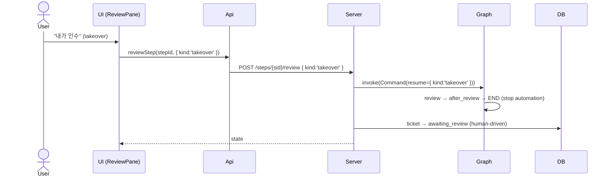
> The takeover affordance lives only in the full ReviewPane ("내가 인수", not the compact summary).
> After takeover the graph ends and the ticket → `awaiting_review`; the human then completes the step
> with a follow-up "승인", which routes through the DB-direct review path (no longer a dead end).

### D5 — Full review pane (전체 리뷰)
<a id="d5"></a>
**Trigger:** "전체 리뷰" in the Cockpit summary opens the full-screen gate (left = diff, right = map slice + decision + acceptance, bottom = approve/changes/takeover).

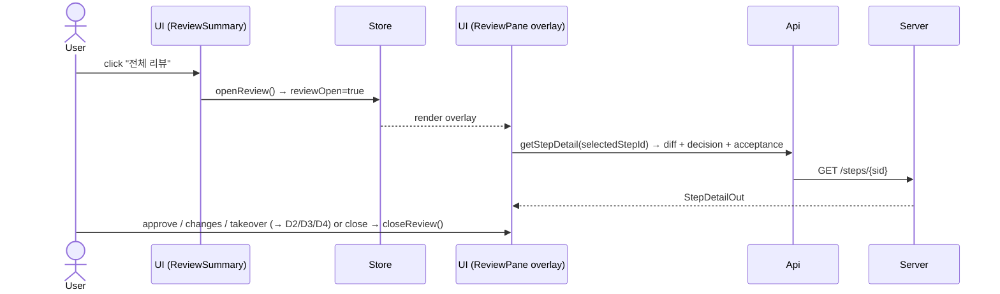

### D6 — Debug-trace a blocked step
<a id="d6"></a>
**Trigger:** open a **blocked** ticket → its blocked step sits in the AWAITING-REVIEW lane with a red "디버그 추적" CTA → drills into the Cockpit on that step (failure + "전체 리뷰에서 추적").

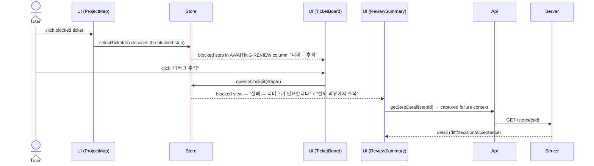

---

## E. Memory, promotion & lifecycle

### E1 — RAG context injected into the step prompt
<a id="e1"></a>
**Trigger:** automatic on every step execution — prior decisions are retrieved and prepended to the agent prompt so the executor recalls earlier choices.

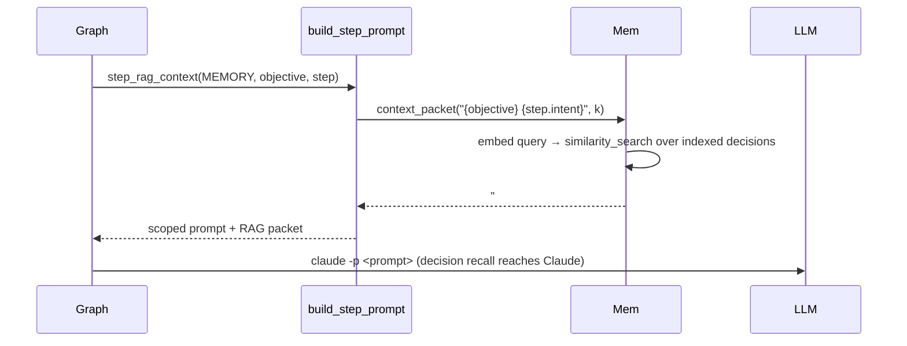

### E2 — Project completion → wiki promotion
<a id="e2"></a>
**Trigger:** approving the **last** step of the **last** ticket. The project's Decisions are distilled into `~/llm_wiki` and indexed for cross-project recall.

```mermaid
sequenceDiagram
    actor User
    participant Pane as UI (ReviewPane)
    participant Api
    participant Server
    participant Graph
    participant DB
    participant Wiki
    participant Mem
    User->>Pane: approve the final step
    Pane->>Api: reviewStep(lastStep, { kind:'approve' })
    Api->>Server: POST /steps/{sid}/review
    Server->>Graph: resume → END; ticket → done
    Server->>DB: _all_tickets_done(project)?
    DB-->>Server: yes
    Server->>DB: promote_project → read all Decision nodes
    loop each decision
        Server->>Wiki: write asv3-{project}-{node}.md (frontmatter + text)
        Server->>Mem: index_text(decision, {wiki_path, node_id, kind})
    end
    Server-->>Pane: state (project complete)
```

### E3 — Memory search (API)
<a id="e3"></a>
**Trigger:** `GET /memory/search?q=&k=` — semantic retrieval over indexed decisions/wiki pages. (API-level; not yet wired to a UI control.)

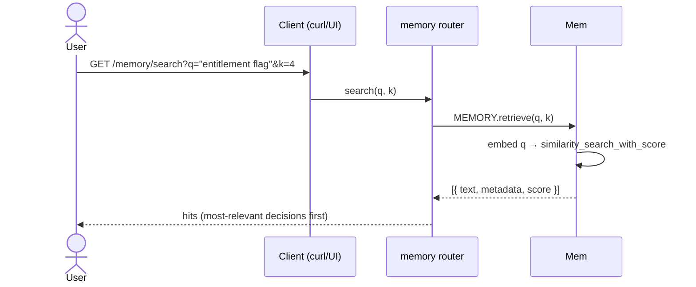

### E4 — Memory reindex (API)
<a id="e4"></a>
**Trigger:** `POST /memory/reindex/{project_id}` — (re)build the vector index from a project's Decision nodes.

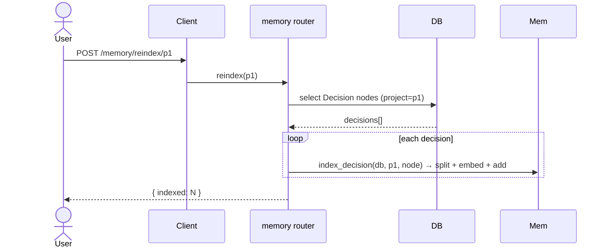

### E5 — Checkpoint/resume & simulated vs real
<a id="e5"></a>
**Trigger:** cross-cutting. Every plan/approve/review request rebuilds the per-ticket graph against a shared checkpointer (`thread_id = ticket:{id}`), so an interrupt is durable across requests; mode selects stub vs real agents.

```mermaid
sequenceDiagram
    participant Server as lifecycle router
    participant CP as Checkpointer (Memory/Postgres)
    participant Graph
    participant Agents as Planner/Executor
    Server->>Graph: _build(db, pid, tid) with shared checkpointer + callbacks
    Note over Graph,CP: thread_id "ticket:{id}" → resume the saved interrupt
    Server->>Graph: get_state(cfg) → awaiting (plan_approval | review)
    Server->>Graph: invoke(Command(resume=...)) → advance + re-checkpoint
    alt ASV3_AGENT_MODE = real
        Graph->>Agents: CliPlanner / CliExecutor (claude -p) — or LangChainPlanner with API key
    else simulated (default)
        Graph->>Agents: SimulatedPlanner / SimulatedExecutor (deterministic, no quota)
    end
```

---

## Coverage notes

- **Display-only states** (session clock, "live" indicator, ticket display-status / step-index label
  computation, empty/error states) are derived UI, not interaction flows — folded into the diagrams above.
- **Status legend:** all flows are **implemented**. The *CodeRegion-layer toggle*, *review-gate keyboard
  shortcuts a/r/t*, and the *takeover hand-off* (a taken-over step can now be completed via a follow-up
  approve through the DB-direct review path) were completed in the 2026-06-29 defect-fix pass
  (see [`defects.md`](defects.md) / [`user-flows-e2e-findings.md`](user-flows-e2e-findings.md)). The
  *Takeover front-end affordance* still lives only in the full ReviewPane (not the compact summary), and
  *Memory search/reindex* remain API-only (no UI control).
- **Mock vs real:** every write flow (C/D/E) runs against the real backend with `VITE_API_BASE`; the
  `MockApiClient` faithfully simulates the same state transitions in-browser (with a 900 ms execution gate)
  so the UI demos the full lifecycle without a server.
